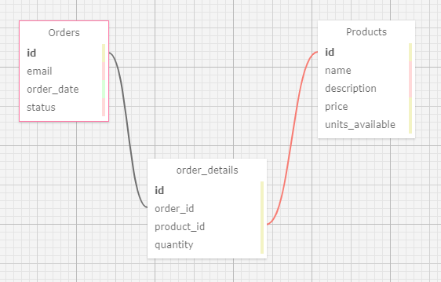

# Inventory & Order System REST API

> A CRUD API for tracking inventory and orders

## Table of Contents

1. [Requirements](#Requirements)
2. [Setup](#Setup)
3. [Application Summary](#application-summary)
4. [Usage](#Usage)
   - [API Summary](#api-summary)
   - [Responses](#Responses)
   - [Requests](#Requests)

## Requirements
- Node.js 6.0+
- Postgresql (this project uses Postgres 11, but earlier version should work with sequelize and the pg package)

## Setup
- Close this repo to your local machine
- Ensure that you have a running Postgres server with a database and working superuser account
- Run `npm install` from the root directory
- In the root directory, create a `.env` file (or change the [exampledotev](./exampledotenv) file and rename it to `.env` and add/change the following lines:
  - DATABASE=`(name of your database)`
  - DATABASE_USER=`(name of your superuser)`
  - DATABASE_PASSWORD=`(your superuser password)`
  - PORT=`(the port on which you'd like to expose the API)`
- Although it may not matter, you should make sure to add your `.env` file to your `.gitignore` to avoid sharing your database password with curious bots
- Fill the `.env` variables with your own values (PORT will, however, default to 3000 if left blank)
- Run `npm run start` to start the express server
- Run `npm run test` to confirm that the server and db are up and running without issue
- You should now be able to query the endpoints as shown [below](#Usage)

## Application Summary

This API currently has two types of endpoints: `/inventory` and `/orders`. These endpoints are controlled by [/controllers/index.js](./controllers/index.js).

The controllers make use of three models:
- `Inventory`
- `Orders`
- `OrderDetails`



For each order, there are one or more `OrderDetails` entities associated with that order's `orderId`. Each `OrderDetails` entity contains an `inventoryId` for the associated order and the quantity of the item that was ordered.

## Usage

Below are the requests and responses for this API. The express server listens on port 3000 by default.

### API Summary

#### Inventory
Request | URL | Method | Returns | Inputs
--------- | ---------- | ---------- | ---------- | ----------
Create inventory item | /inventory | POST | [inventory_item_created](#inventory_item_created) | [create_inventory_item](#create_inventory_item)
Read all inventory items | /inventory | GET | [inventory_items](#inventory_items) | none
Read single inventory item | /inventory/:id | GET | [inventory_item](#inventory_item) | param: `id`
Update inventory item | /inventory/:id | PUT | [inventory_item_updated](#inventory_item_updated) | param: `:id`, [update_inventory_item](#update_inventory_item)
Delete inventory item | /inventory/:id | DELETE | [inventory_item_deleted](#inventory_item_deleted) | param: `id`

#### Orders
Request | URL | Method | Returns | Inputs
--------- | ---------- | ---------- | ---------- | ----------
Create order | /orders | POST | [order_created](#order_created) | [create_order](#create_order)
Read all orders | /orders | GET | [orders](#orders) | none
Read single order | /orders/:id | GET | [order](#order) | param: `id`
Update order | /orders/:id | PUT | [order_updated](#order_updated) | param: `:id`, [update_order](#update_order)
Delete order | /orders/:id | DELETE | [order_deleted](#order_deleted) | param: `id`

### Responses

Response payloads are the following:

#### Inventory
##### inventory_item_created
```json
  {
    "item": {
        "id": 1,
        "name": "Haribo",
        "description": "Gummies",
        "price": "19.99",
        "units_available": 10,
        "updatedAt": "2020-02-05T16:44:55.187Z",
        "createdAt": "2020-02-05T16:44:55.187Z"
    }
  }
```
##### inventory_items
```json
  {
    "items": [
        {
            "id": 1,
            "name": "Haribo",
            "description": "Gummies",
            "price": "19.99",
            "units_available": 10,
            "createdAt": "2020-02-06T04:57:14.914Z",
            "updatedAt": "2020-02-06T04:57:14.914Z"
        },
        {
            "id": 2,
            "name": "Generic",
            "description": "Gummies",
            "price": "19.99",
            "units_available": 10,
            "createdAt": "2020-02-06T04:57:24.529Z",
            "updatedAt": "2020-02-06T04:57:24.529Z"
        },
        {
            "id": 3,
            "name": "Premium",
            "description": "Gummies",
            "price": "19.99",
            "units_available": 10,
            "createdAt": "2020-02-06T04:57:31.889Z",
            "updatedAt": "2020-02-06T04:57:31.889Z"
        }
    ]
  }
```
##### inventory_item
```json
  {
    "item": {
        "id": 1,
        "name": "Haribo",
        "description": "Gummies",
        "price": "19.99",
        "units_available": 10,
        "createdAt": "2020-02-06T04:57:14.914Z",
        "updatedAt": "2020-02-06T04:57:14.914Z"
    }
  }
```
##### inventory_item_updated
```json
  {
    "item": [
        1
    ]
  }
```
##### inventory_item_deleted
Returns original inventory item
```json
  {
    "id": 1,
    "name": "Haribobo",
    "description": "Jumbo Gummies",
    "price": "44.99",
    "units_available": 100,
    "createdAt": "2020-02-06T04:57:14.914Z",
    "updatedAt": "2020-02-06T04:59:35.453Z"
  }
```
#### Orders

##### order_created
```json
  {
    "order": {
        "id": 1,
        "email": "me@aol.com",
        "order_date": "2020-01-31T19:21:38.587Z",
        "status": "pending",
        "updatedAt": "2020-02-06T05:14:41.695Z",
        "createdAt": "2020-02-06T05:14:41.695Z"
    },
    "details": [
        {
            "id": 1,
            "inventoryId": 1,
            "quantity": 5,
            "orderId": 1,
            "createdAt": "2020-02-06T05:14:41.736Z",
            "updatedAt": "2020-02-06T05:14:41.736Z"
        },
        {
            "id": 2,
            "inventoryId": 1,
            "quantity": 5,
            "orderId": 1,
            "createdAt": "2020-02-06T05:14:41.736Z",
            "updatedAt": "2020-02-06T05:14:41.736Z"
        }
    ]
  }
```
##### orders
```json
  {
    "orders": [
        {
            "id": 1,
            "email": "me@aol.com",
            "order_date": "2020-01-31T19:21:38.587Z",
            "status": "pending",
            "createdAt": "2020-02-06T05:14:41.695Z",
            "updatedAt": "2020-02-06T05:14:41.695Z"
        },
        {
            "id": 2,
            "email": "me@aol.com",
            "order_date": "2020-01-31T19:21:38.587Z",
            "status": "pending",
            "createdAt": "2020-02-06T05:18:34.702Z",
            "updatedAt": "2020-02-06T05:18:34.702Z"
        }
    ]
  }
```
##### order
```json
  {
    "order": {
        "id": 1,
        "email": "me@aol.com",
        "order_date": "2020-01-31T19:21:38.587Z",
        "status": "pending",
        "createdAt": "2020-02-06T05:14:41.695Z",
        "updatedAt": "2020-02-06T05:14:41.695Z"
    },
    "details": [
        {
            "id": 1,
            "quantity": 5,
            "createdAt": "2020-02-06T05:14:41.736Z",
            "updatedAt": "2020-02-06T05:14:41.736Z",
            "orderId": 1,
            "inventoryId": 1
        },
        {
            "id": 2,
            "quantity": 5,
            "createdAt": "2020-02-06T05:14:41.736Z",
            "updatedAt": "2020-02-06T05:14:41.736Z",
            "orderId": 1,
            "inventoryId": 1
        }
    ]
  }
```
##### order_updated
Returns original order
```json
  {
    "id": 1,
    "email": "me@aol.com",
    "order_date": "2020-01-31T19:21:38.587Z",
    "status": "pending",
    "createdAt": "2020-02-06T05:14:41.695Z",
    "updatedAt": "2020-02-06T05:14:41.695Z"
  }
```
##### order_deleted
Returns original order
```json
  {
    "id": 2,
    "email": "me@aol.com",
    "order_date": "2020-01-31T19:21:38.587Z",
    "status": "pending",
    "createdAt": "2020-02-06T05:18:34.702Z",
    "updatedAt": "2020-02-06T05:18:34.702Z"
  }
```

### Requests

These endpoints expect the following request body JSON:

#### Inventory

##### create_inventory_item
```json
  {
    "name": "Haribo",
    "description": "Gummies",
    "price": 19.99,
    "quantity": 10
  }
```
##### update_inventory_item
```json
  {
    "name": "Haribobo",
    "description": "Jumbo Gummies",
    "price": 44.99,
    "quantity": 100
  }
```

#### Orders

##### create_order
```json
  {
    "email": "me@aol.com",
    "order_date": "2020-01-31T19:21:38.587Z",
    "status": "pending",
    "items": [
      {
        "inventoryId": 1,
        "quantity": 5
      },
      {
        "inventoryId": 1,
        "quantity": 5
      }
    ]
  }
```
##### update_order
```json
  {
    "email": "me@silk.net",
    "status": "cancelled"
  }
```